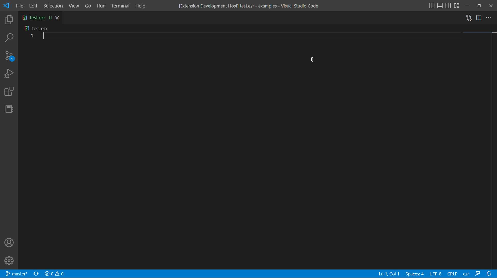

# ezr language support README
Official VSCode extension for the ezr programming language!

What is ezr? [**Check it out!**](https://github.com/Uralstech/ezrlang)
Found a bug? [**Report it!**](https://github.com/Uralstech/ezr-language-support/issues)

## Features

### **Syntax Highlighting & Icon Theme**

### **Code Snippets**

## Known Issues
None yet.

## Release Notes

### 1.5.0 - Support for ezr 1.18.4.0 and 1.18.4.1

### 1.4.0 - Support for ezr v1.18.2.0 and v1.18.3.0

### 1.3.0 - Support for ezr v1.18.1.0

### 1.2.0 - Support for ezr v1.18.0.0 (i.e. ezr m18)

### 1.1.0 - Support for ezr v1.16.0.0

### 1.0.0
- Added syntax highlighting
- Added snippets
- Added icon theme