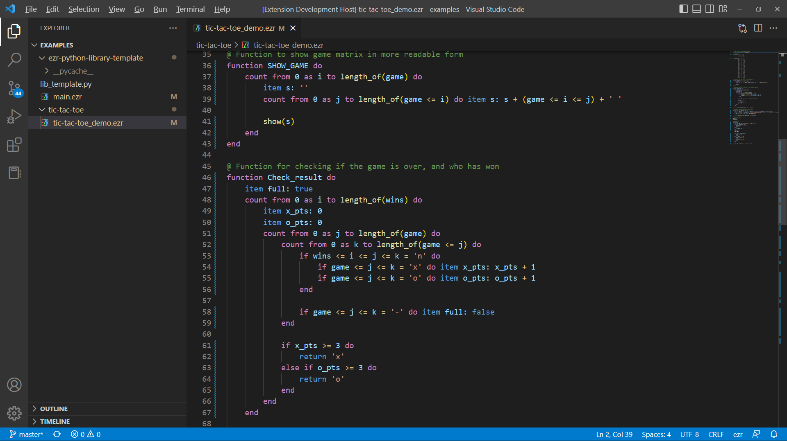
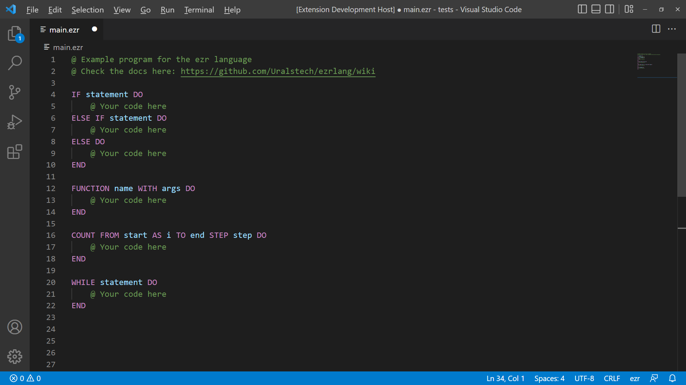

# ezr-language-support README
Official VSCode extension for the ezr programming language!

What is ezr? [**Check it out!**](https://github.com/Uralstech/ezrlang)
Found a bug? [**Report it!**](https://github.com/Uralstech/ezrlang/issues)

## Features

### **Syntax Highlighting**

### **Code Snippets**

## Known Issues
None yet.

## Release Notes
### 1.0.0
- Syntax highlighting for the ezr programming language
- Snippets for the ezr programming language